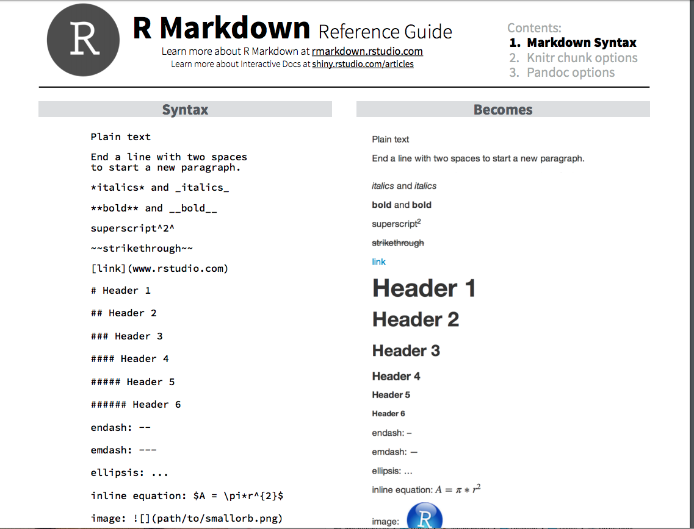
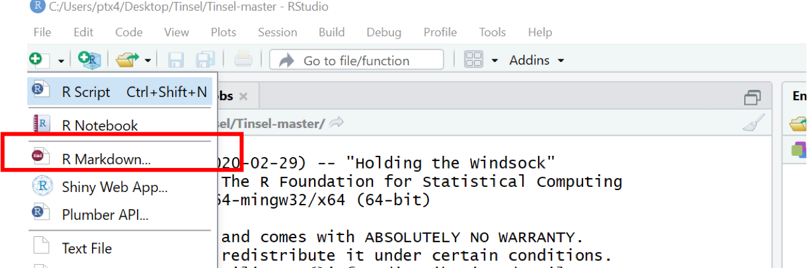

# Highlights on our tour of Rmarkdown

* What is markdown
* What is Rmarkdown 
* Integrating references using BibTeX
* Analyses using R
* Equations and other formatting with LaTeX
* Formatting references using CSL files
* Incorporating version control with git/github

# Markdown

[link to pdf](https://rstudio.com/wp-content/uploads/2015/03/rmarkdown-reference.pdf)

# Rmarkdown

[link to Rmarkdown](https://rmarkdown.rstudio.com/lesson-1.html)

:::::::::::::: {.columns}
::: {.column}
Data science is an exciting discipline that allows you to turn raw data into understanding, insight, and knowledge. The goal of “R for Data Science” is to help you learn the most important tools in R that will allow you to do data science.
:::
::: {.column}

:::
::::::::::::::